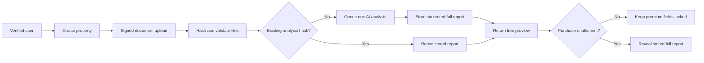

# DwellCheck product and production architecture

## Product position

DwellCheck is a first-pass document review for home buyers. It helps people decide which
properties deserve professional legal attention; it must never claim to replace a lawyer or
provide legal advice.

Recommended launch offer:

- One free preview per verified person, showing the two highest-priority findings
- NZ$19.99 one-off full report for one property
- Add a 3- or 5-report buyer bundle only after real usage and cost data is available
- Avoid an unlimited subscription because document-heavy users create uncapped AI cost

The prototype display price is environment-configurable. Production pricing is owned by the
App Store Connect In-App Purchase product, and the mobile app displays the localized StoreKit
price instead of trusting a hardcoded amount.

Because the same buyer may purchase reports for multiple properties, the per-report product
should be configured as a **consumable** In-App Purchase. Each verified transaction is attached
to exactly one report or one paid analysis reservation in the backend. A non-consumable product
would normally be purchasable only once for the account and is therefore the wrong fit for
repeated property reports.

The full structured report is generated once. The database stores both:

- `preview_payload`: safe summary and the allowed free findings
- `full_payload_encrypted`: every finding, source, confidence, and suggested next step

Before payment, the mobile API response contains only `preview_payload` and deliberately limited
locked-finding summaries. It must never include `full_payload_encrypted`, premium detail, source
references, or decryption material. After the server verifies the signed App Store or Play Store
transaction and confirms report ownership, a separate authenticated endpoint returns the full
report.

Payment changes the user's entitlement; it does not enqueue another AI job.

## Recommended stack

| Layer | Recommendation | Why |
| --- | --- | --- |
| Mobile | Expo / React Native | iOS now, Android from the same codebase |
| Authentication | Supabase Auth with Apple and Google | Verified identity, account linking, low initial ops burden |
| Database | Supabase Postgres | Users, properties, jobs, entitlements, audit data |
| Document storage | Private Supabase Storage or S3 | Signed uploads, retention policy, per-user access |
| Job runner | Serverless API plus queue/worker | Keeps long AI work away from the phone request |
| Payments | StoreKit on iOS, Google Play Billing on Android; RevenueCat optional | Store-compliant entitlements across platforms |
| AI | OpenAI Responses API, server-side only | Multimodal PDF input and structured report output |
| Observability | Sentry plus token/cost ledger | Crash visibility and per-report unit economics |

Never place an OpenAI key, storage service key, or payment secret in the mobile application.

## Request flow



## AI pipeline

1. Validate MIME type, file size, page count, and malware scan result.
2. Compute a SHA-256 hash for every file and a stable hash for the whole document set.
3. Send PDFs directly as `input_file` items. OpenAI currently supplies both extracted text and
   page images to vision-capable models, so converting every page beforehand is unnecessary.
4. Use a cost-efficient vision model for classification and first-pass extraction.
5. Escalate only low-confidence or high-risk pages to a stronger model at high/original image
   detail.
6. Ask for strict structured output matching a versioned report schema.
7. Run deterministic checks for dates, totals, missing fields, duplicate findings, and source
   references.
8. Store confidence and exact source locations. Do not present uncertain text as fact.

A sensible starting model policy is GPT-5.4 mini for broad extraction and GPT-5.4 or the current
flagship only for targeted difficult pages. Model choice must be validated on a New Zealand
property-document evaluation set before launch.

## Abuse and cost controls

Enforce these controls on the server, not only in the app:

- Require Apple or Google authentication before the first upload
- One free preview per verified account and, as a secondary signal, per device
- Rate-limit property creation, uploads, and analysis starts separately
- Maximum 6 files, 30 MB combined, and a configurable page cap for the free preview
- Deduplicate exact files and complete document sets by cryptographic hash
- Idempotency key on every analysis job
- No user-controlled prompt text in the first release
- Daily and monthly spend ceilings with automatic queue pause
- Record input tokens, cached tokens, output tokens, model, retries, and cost for every job
- Retry only transient failures; never automatically rerun a completed analysis
- Delete raw uploads after a short disclosed retention period unless the user explicitly saves
  them
- Flag suspicious multi-account/device patterns for manual review

The current prototype now persists its visible preview allowance locally so the counter behaves
correctly during testing. This is not an anti-abuse control. Production allowance is stored and
atomically consumed in the backend database; reinstalling the app or editing local storage must
not restore it.

Prompt caching can reduce repeated instruction cost. Batch processing can reduce model cost, but
its asynchronous timing may be unsuitable for an interactive report unless the product sets a
longer expectation.

## Suggested core tables

```text
users
  id, auth_provider, created_at, free_preview_used_at, risk_flags

properties
  id, user_id, address, status, created_at

documents
  id, property_id, storage_key, sha256, mime_type, bytes, pages, retained_until

analysis_jobs
  id, property_id, document_set_hash, status, model_policy, prompt_version,
  input_tokens, cached_tokens, output_tokens, estimated_cost, started_at, completed_at

reports
  id, property_id, job_id, schema_version, preview_payload,
  full_payload_encrypted, created_at

entitlements
  id, user_id, report_id, store, product_id, transaction_id, status, purchased_at
```

Use row-level security so a user can read only their own properties and reports. A mobile client
must never be able to write `analysis_jobs.status`, `reports`, or `entitlements` directly.

## API outline

```text
POST /v1/properties
POST /v1/properties/:id/uploads/sign
POST /v1/properties/:id/analyse
GET  /v1/analysis-jobs/:id
GET  /v1/reports/:id
POST /v1/purchases/apple/verify
POST /v1/purchases/google/verify
POST /v1/reports/:id/unlock
DELETE /v1/properties/:id
```

`POST /analyse` should return the existing job or report when the document-set hash and prompt
version already exist.

`POST /reports/:id/unlock` must verify the authenticated user, server-side entitlement, signed
store transaction, and report ownership. A client-supplied `paid: true` flag is never trusted.

## Accuracy, safety, and launch gates

- Build a de-identified evaluation set covering Sale & Purchase Agreements, LIMs, titles,
  building reports, body corporate records, handwritten amendments, scans, and rotated pages.
- Have a New Zealand conveyancing lawyer define the issue taxonomy and review at least the
  high-risk test cases.
- Measure finding precision, missed critical issues, source-reference accuracy, and handwritten
  field accuracy separately.
- Show confidence-aware wording such as “appears”, “could not confirm”, and “ask your lawyer”.
- Provide a clear correction/reporting path and retain prompt/schema versions for auditability.
- Obtain local privacy and legal advice before accepting real customer documents.

## Platform requirements that affect the product

Apple's current review rules require in-app purchase to unlock digital functionality inside an
app. If Google sign-in is offered for the primary account, the iOS app must also offer an
equivalent privacy-preserving login option; Sign in with Apple is the standard implementation.

## Source notes

- [OpenAI file inputs](https://developers.openai.com/api/docs/guides/file-inputs)
- [OpenAI image and vision detail](https://developers.openai.com/api/docs/guides/images-vision)
- [OpenAI structured outputs](https://developers.openai.com/api/docs/guides/structured-outputs)
- [OpenAI API pricing](https://openai.com/api/pricing/)
- [Apple App Review Guidelines](https://developer.apple.com/app-store/review/guidelines/)
- [Expo SDK 56 reference](https://docs.expo.dev/versions/v56.0.0/)
